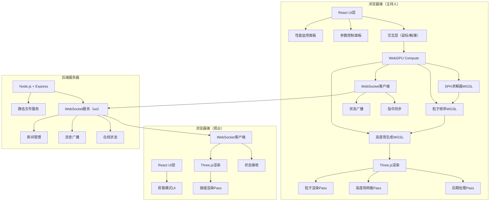
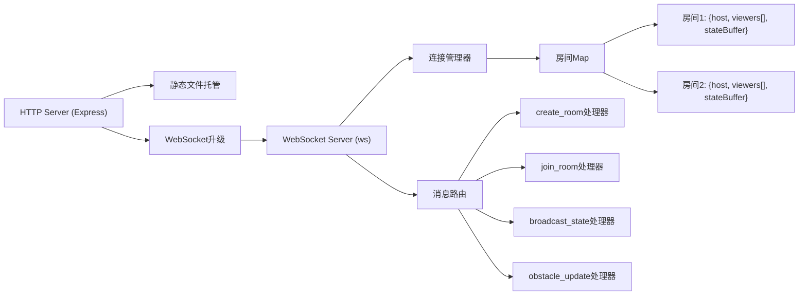
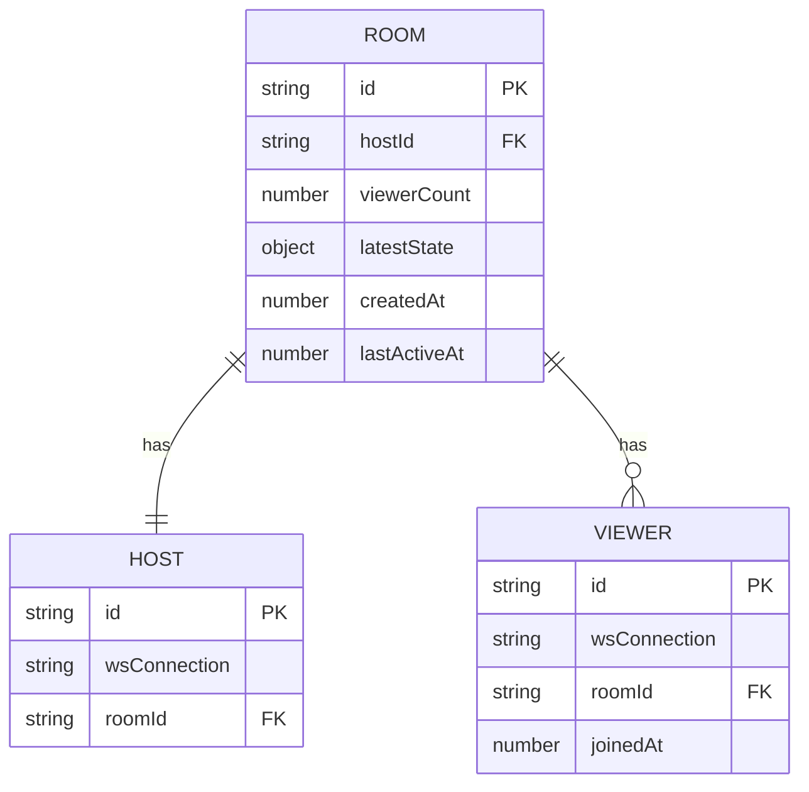

## 1. 架构设计



## 2. 技术描述

### 2.1 前端技术栈
- **框架**：React@18 + TypeScript
- **构建工具**：Vite@5
- **样式方案**：TailwindCSS@3 + CSS Modules
- **WebGPU**：原生 WebGPU API + 手写 WGSL Compute Shader
- **3D渲染**：Three.js@0.160 + @react-three/fiber@8 + @react-three/drei@9 + @react-three/postprocessing@2
- **状态管理**：Zustand
- **WebSocket**：ws（浏览器端）

### 2.2 后端技术栈
- **运行时**：Node.js@20
- **Web框架**：Express@4
- **WebSocket**：ws@8
- **CORS处理**：cors@2

### 2.3 核心技术实现

#### SPH求解器（WebGPU Compute Shader）
- **粒子数**：100,000 - 200,000 可配置
- **内存布局**：Struct of Arrays (SoA) 优化GPU访问
- **核心Pass**：
  1. 密度计算 Pass - 计算每个粒子的密度
  2. 压强计算 Pass - 使用理想气体状态方程
  3. 粘性力计算 Pass - 计算粒子间粘性
  4. 积分更新 Pass - 更新位置和速度
  5. 碰撞检测 Pass - 处理边界和障碍物
- **空间哈希**：粒子排序优化邻居搜索，O(n)复杂度

#### 高度场生成
- **分辨率**：256x256 或 512x512 可配置
- **算法**：粒子高度加权平均到网格点，使用高斯核平滑
- **法线计算**：在Compute Shader中一并计算法线用于光照

#### 多人同步策略
- **广播频率**：15-30 FPS 关键帧同步
- **数据压缩**：位置量化、delta编码
- **插值渲染**：观众端使用位置插值保证流畅

## 3. 路由定义

| 路由 | 用途 |
|------|------|
| `/` | 主仿真页面（主持人/单人模式） |
| `/watch/:roomId` | 观众观看页面 |
| `/api/health` | 服务健康检查 |

## 4. API 定义

### 4.1 WebSocket 消息协议

```typescript
// 基础消息结构
interface BaseMessage {
  type: string;
  timestamp: number;
}

// 主持人 -> 服务器
interface CreateRoomMessage extends BaseMessage {
  type: 'create_room';
  hostId: string;
}

interface BroadcastStateMessage extends BaseMessage {
  type: 'broadcast_state';
  roomId: string;
  frame: number;
  particleCount: number;
  heightFieldData: Uint16Array; // 压缩后的高度场
  obstacleData: ObstacleData[];
  stats: PerformanceStats;
}

interface ObstacleUpdateMessage extends BaseMessage {
  type: 'obstacle_update';
  roomId: string;
  obstacles: ObstacleData[];
}

// 观众 -> 服务器
interface JoinRoomMessage extends BaseMessage {
  type: 'join_room';
  roomId: string;
  viewerId: string;
}

// 服务器 -> 客户端
interface RoomCreatedMessage extends BaseMessage {
  type: 'room_created';
  roomId: string;
  hostId: string;
}

interface StateUpdateMessage extends BaseMessage {
  type: 'state_update';
  frame: number;
  particleCount: number;
  heightFieldData: Uint16Array;
  obstacleData: ObstacleData[];
  stats: PerformanceStats;
}

interface ViewerJoinedMessage extends BaseMessage {
  type: 'viewer_joined';
  viewerId: string;
  viewerCount: number;
}

interface ViewerLeftMessage extends BaseMessage {
  type: 'viewer_left';
  viewerId: string;
  viewerCount: number;
}

// 数据结构
interface ObstacleData {
  id: string;
  type: 'circle' | 'line' | 'rect';
  x: number;
  y: number;
  radius?: number;
  width?: number;
  height?: number;
  rotation?: number;
}

interface PerformanceStats {
  fps: number;
  particleCount: number;
  computeTime: number;
  renderTime: number;
  totalTime: number;
}
```

## 5. 服务器架构图



## 6. 数据模型

### 6.1 内存数据模型



### 6.2 GPU 数据布局

```typescript
// 粒子数据 (SoA布局，每个属性独立buffer)
interface ParticleBuffers {
  positionX: Float32Array;  // [n] x坐标
  positionY: Float32Array;  // [n] y坐标
  velocityX: Float32Array;  // [n] x速度
  velocityY: Float32Array;  // [n] y速度
  density: Float32Array;    // [n] 密度
  pressure: Float32Array;   // [n] 压强
  color: Float32Array;      // [n*4] RGBA颜色
}

// 统一变量
interface SimulationParams {
  particleCount: number;
  smoothingRadius: number;
  restDensity: number;
  viscosity: number;
  pressureStiffness: number;
  gravityX: number;
  gravityY: number;
  damping: number;
  boundaryMinX: number;
  boundaryMaxX: number;
  boundaryMinY: number;
  boundaryMaxY: number;
  timeStep: number;
}

// 高度场输出
interface HeightField {
  width: number;
  height: number;
  data: Float32Array;  // [width*height] 高度值
  normals: Float32Array; // [width*height*3] 法线
}
```
