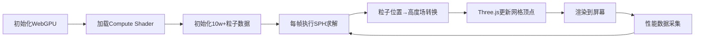
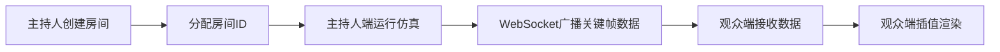
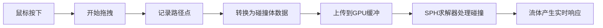

## 1. 产品概述

基于WebGPU的高性能实时流体仿真应用，使用SPH（光滑粒子流体动力学）算法模拟10万+粒子的流体行为，通过Three.js渲染为动态地形，支持交互式障碍物创建和多人协同观看。

- **核心价值**：展示WebGPU通用计算能力，提供沉浸式流体物理仿真体验
- **目标用户**：技术爱好者、教育领域、可视化从业者
- **核心场景**：单人交互仿真、多人协同观摩学习

## 2. 核心特性

### 2.1 用户角色

| 角色 | 加入方式 | 核心权限 |
|------|----------|----------|
| 主持人 | 直接进入 | 控制仿真、创建障碍物、调整参数 |
| 观众 | 通过分享链接加入 | 观看实时仿真状态、查看性能数据 |

### 2.2 功能模块

1. **仿真主界面**：WebGPU流体渲染区域、Three.js动态地形、交互控制
2. **控制面板**：参数调节（粒子数、粘度、压强）、障碍物管理、仿真控制
3. **性能监控面板**：FPS、粒子数、Compute Shader耗时、渲染耗时
4. **多人模式**：WebSocket实时广播、房间管理、观众链接分享

### 2.3 页面详情

| 页面名称 | 模块名称 | 功能描述 |
|----------|----------|----------|
| 仿真主页面 | 流体渲染区 | WebGPU粒子渲染、Three.js高度场网格渲染 |
| 仿真主页面 | 交互层 | 鼠标拖拽绘制障碍物、点击添加粒子源 |
| 仿真主页面 | 控制面板 | 仿真参数滑块、预设场景选择、重置按钮 |
| 仿真主页面 | 性能监控 | 实时FPS图表、计算耗时统计、粒子数显示 |
| 仿真主页面 | 多人控制 | 创建/加入房间、链接分享、在线人数显示 |

## 3. 核心流程

### 3.1 仿真运行流程

### 3.2 多人同步流程

### 3.3 障碍物交互流程

## 4. 用户界面设计

### 4.1 设计风格

- **主色调**：深海蓝 `#0a1628` 作为背景，流体粒子使用青色渐变 `#00d4ff` → `#0066ff`
- **强调色**：霓虹粉 `#ff0080` 用于交互元素和障碍物高亮
- **字体**：显示字体使用 `Space Mono`（等宽科技感），正文字体使用 `Inter`
- **布局风格**：沉浸式全屏画布，浮动半透明控制面板，科技感HUD风格
- **视觉效果**：深色背景配合发光粒子、体积光、后期 bloom 效果

### 4.2 页面设计概述

| 页面名称 | 模块名称 | UI元素 |
|----------|----------|--------|
| 主界面 | 流体渲染区 | 全屏Canvas、动态粒子、高度场网格、发光边缘 |
| 主界面 | 性能面板 | 左上角半透明卡片、实时折线图、数值标签、背景毛玻璃 |
| 主界面 | 控制面板 | 右侧折叠式面板、滑块控件、预设按钮、开关切换 |
| 主界面 | 多人状态栏 | 底部居中胶囊式显示、在线人数、房间ID、复制按钮 |
| 主界面 | 操作提示 | 左下角浮动文字、渐入渐出动画、快捷键说明 |

### 4.3 响应式设计

- **桌面端优先**：充分利用大屏显示完整控制面板
- **平板适配**：控制面板可折叠为图标按钮
- **移动端**：简化控制参数，保留核心观看功能
- **触摸优化**：支持多指触控缩放视角、单指拖拽绘制

### 4.4 3D场景指导

- **环境**：深色太空/深海风格，HDRI使用工作室冷光环境
- **光照**：主光源使用方向光模拟水面反射，点光源跟随粒子高密度区域
- **相机**：初始使用45度俯视角度，支持轨道控制缩放旋转
- **后期处理**：Bloom泛光效果、轻微色差、FXAA抗锯齿
- **粒子渲染**：使用圆形精灵，带透明度衰减和颜色渐变
- **高度场网格**：Wireframe模式渲染，顶点颜色映射高度值，边缘发光
